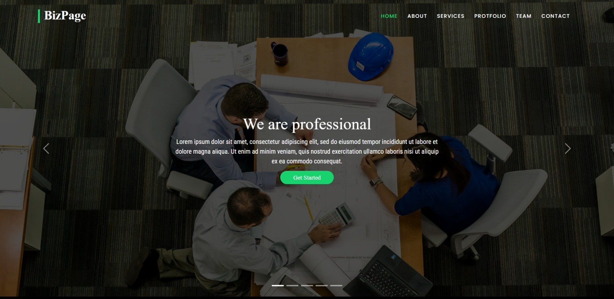
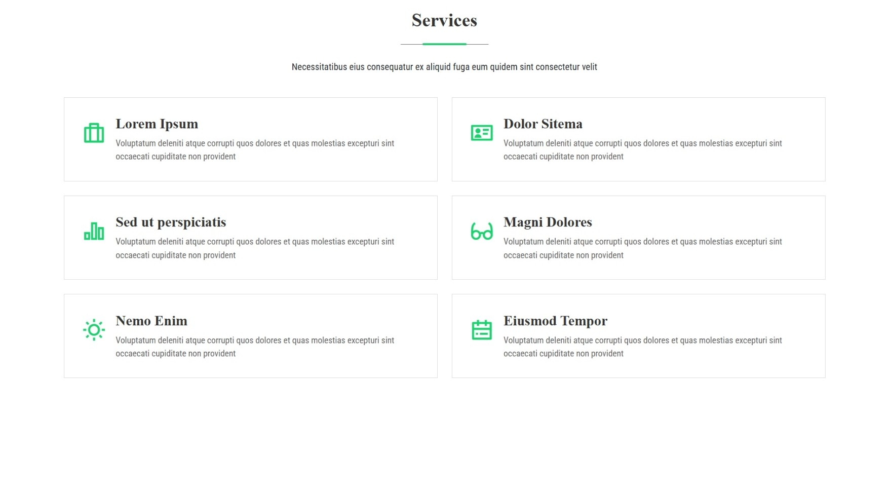
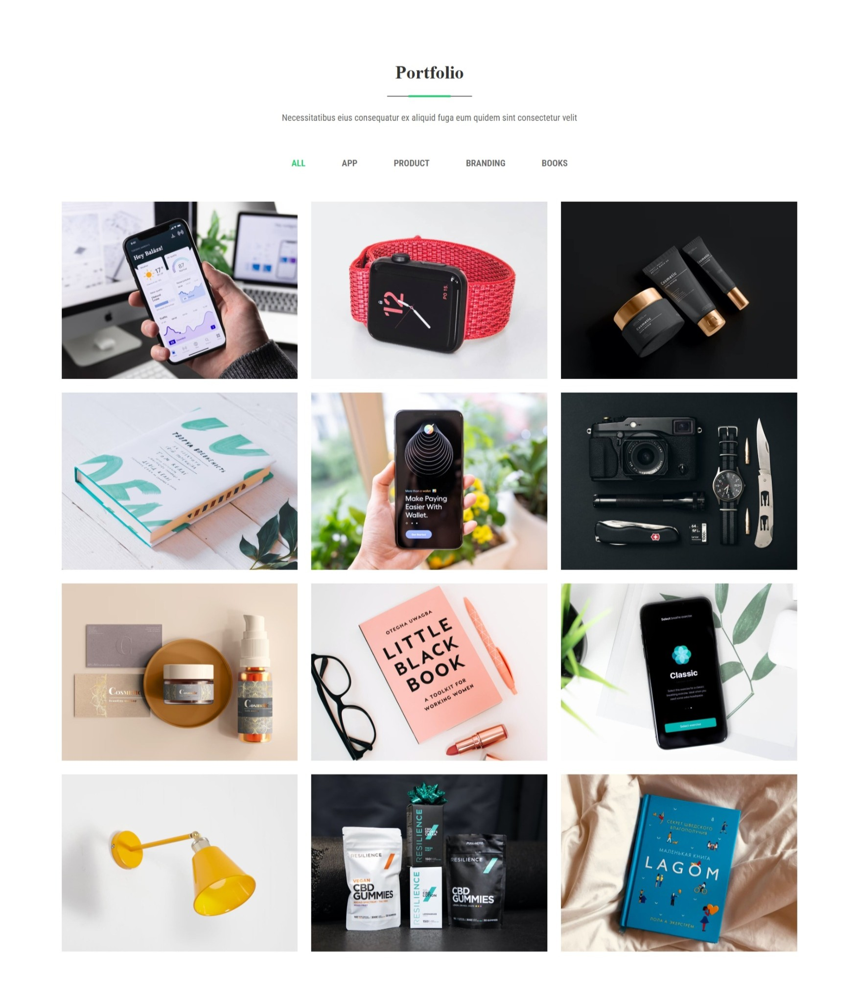
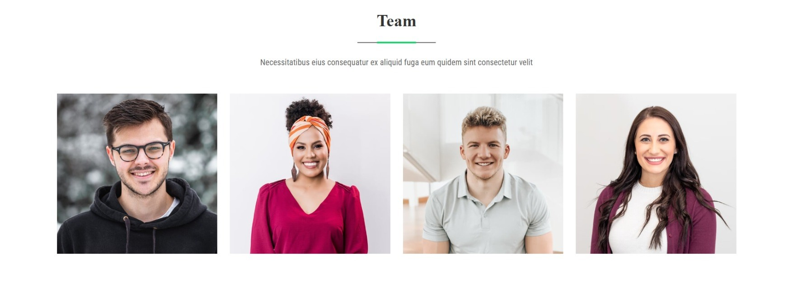
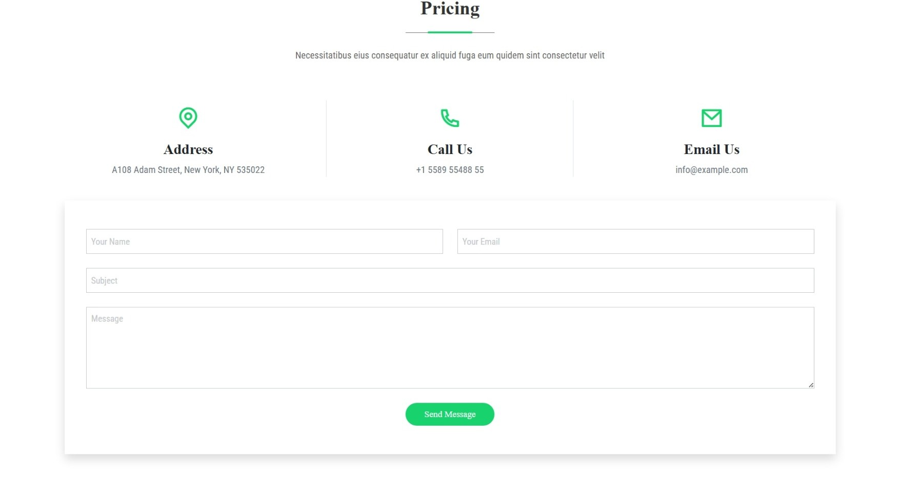

# 🚀 BizPage – Business Website Template

A modern, responsive, and professional business website built using **HTML, CSS, Bootstrap & JavaScript**.  
Perfect for agencies, startups, corporate websites, and portfolios.

---

## 🌐 Live Preview
👉

---

## 📸 Project Screenshots

### 🏠 Home Page

### 🧩 Services Section

### 💼 Portfolio Section

### 👥 Team Section

### 📞 Contact Section

> 📌 **Note:** Replace image names with your actual screenshot file names.

---

## ✨ Features

- Fully responsive design
- Modern UI / UX
- Bootstrap 5 layout
- Clean & structured code
- Portfolio & gallery sections
- Carousel & animations
- Contact form
- Mobile friendly

---

## 🛠️ Technologies Used

- **HTML5**
- **CSS3**
- **Bootstrap 5**
- **JavaScript**
- **Remix Icons**

---

## 📂 Project Structure

BizPage/
│
├── css/
│ └── style.css
├── js/
│ └── bootstrap.bundle.min.js
├── images/
│ ├── banner/
│ ├── portfolio/
│ ├── team/
│ └── icons/
├── index.html
└── README.md

yaml
Copy code

---

## 🚀 How To Use

1. Download or clone the repository  
2. git clone https://github.com/your-username/BizPage.git
3. Open index.html in your browser

Customize text, images, and colors as per your need

📄 License
This project is licensed under the MIT License.
You are free to use, modify, and distribute this project.

👉 See the LICENSE file for more details.

👨‍💻 Author   
   Krushik

🌐 GitHub: https://mrkrushik.github.io/Bizzpage-website/

⭐ If you like this project, don't forget to star the repository!

---

